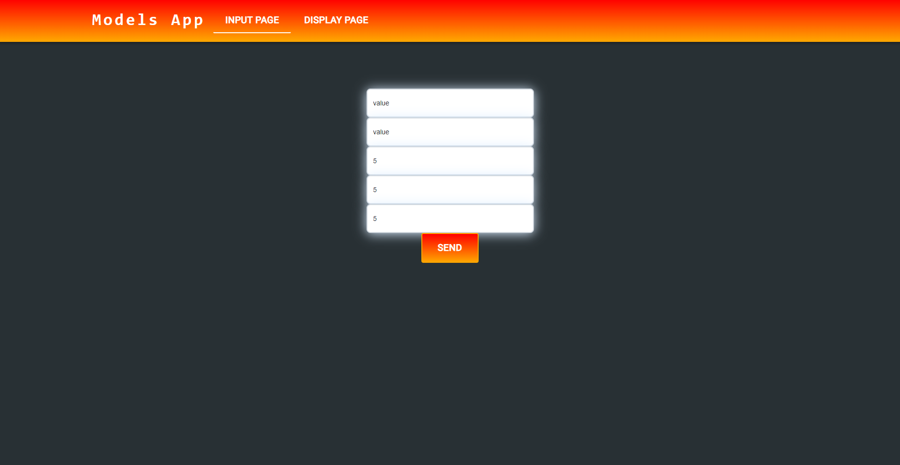
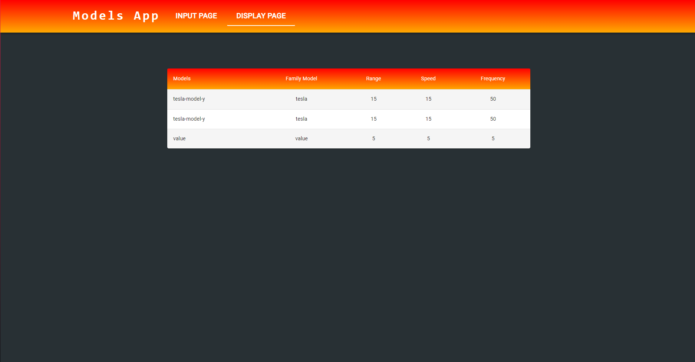

# Model Insertion

## Overview:
This project is responsible for storing models in a C# server with a MongoDB database. While it is a simple project, its goal is to familiarize myself with the following technologies for my job:

- JavaScript
- HTML
- CSS
- React
- Material-UI
- Protocol Buffers (a binary protocol developed by Google to optimize JSON functionality)
- C# ASP.NET Core SignalR
- MongoDB in C#

> [!Note]
> This project was developed for learning purposes. If you use this code as a reference, please keep that in mind.

## dependencies:
- `npm`
- Visual Studio C#
- MongoDB Desktop (running on port 27017)
  
## Run:
1. clone the project
2. enter the `model-insertion` directory and run the command
3. run: `npm install --legacy-peer-deps`
4. run: `npm audit`
5. run: `npm start`
6. enter the `databaseSaveServer` directory
7. enter the solution and run the only project in it

# UI examples:

